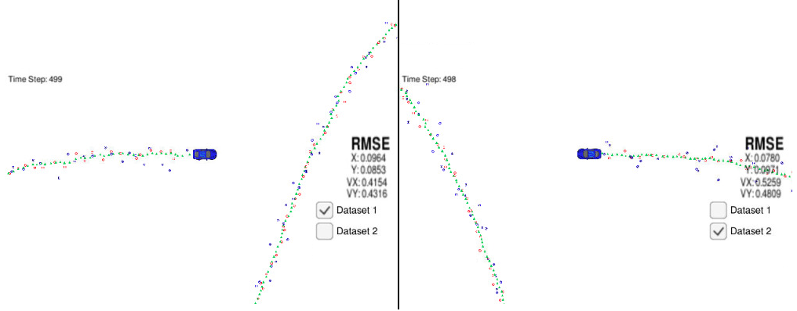
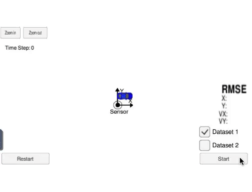
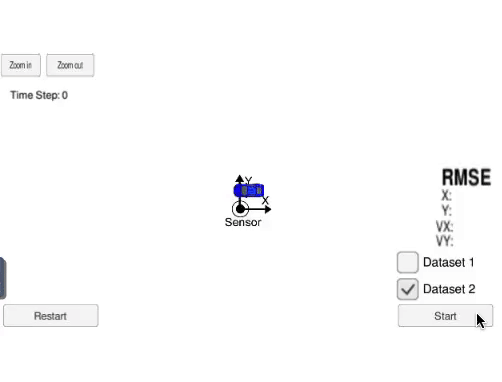

# Extended Kalman Filter Project
Self-Driving Car Engineer Nanodegree Program

In this project a kalman filter to estimate the state of a moving object of interest with noisy lidar and radar measurements is utilized.

This project involves the Term 2 Simulator which can be downloaded [here](https://github.com/udacity/self-driving-car-sim/releases).

This repository includes two files that can be used to set up and install [uWebSocketIO](https://github.com/uWebSockets/uWebSockets) for either Linux or Mac systems. For windows you can use either Docker, VMware, or even [Windows 10 Bash on Ubuntu](https://www.howtogeek.com/249966/how-to-install-and-use-the-linux-bash-shell-on-windows-10/) to install uWebSocketIO.

Once the install for uWebSocketIO is complete, the main program can be built and run by doing the following from the project top directory.

1. mkdir build
2. cd build
3. cmake ..
4. make
5. ./ExtendedKF

## Other Important Dependencies

* cmake >= 3.5
  * All OSes: [click here for installation instructions](https://cmake.org/install/)
* make >= 4.1 (Linux, Mac), 3.81 (Windows)
  * Linux: make is installed by default on most Linux distros
  * Mac: [install Xcode command line tools to get make](https://developer.apple.com/xcode/features/)
  * Windows: [Click here for installation instructions](http://gnuwin32.sourceforge.net/packages/make.htm)
* gcc/g++ >= 5.4
  * Linux: gcc / g++ is installed by default on most Linux distros
  * Mac: same deal as make - [install Xcode command line tools](https://developer.apple.com/xcode/features/)
  * Windows: recommend using [MinGW](http://www.mingw.org/)

## Basic Build Instructions

1. Clone this repo.
2. Make a build directory: `mkdir build && cd build`
3. Compile: `cmake .. && make` 
   * On windows, you may need to run: `cmake .. -G "Unix Makefiles" && make`
4. Run it: `./ExtendedKF `

## Results
In two different simulated runs, my Extended Kalman Filter produces the below results. The x-position is shown as 'px', y-position as 'py', velocity in the x-direction is 'vx', while velocity in the y-direction is 'vy'. Residual error is calculated by mean squared error (MSE).

**Simulation for the Dataset-1**  
  
| Input |   MSE   |
| ----- | ------- |
|  px   | 0.0093 |
|  py   | 0.0073 |
|  vx   | 0.1729 |
|  vy   | 0.1867 |

  
  

**Simulation for the Dataset-2**  
  
| Input |   MSE   |
| ----- | ------- |
|  px   | 0.0061 |
|  py   | 0.0094 |
|  vx   | 0.2762 |
|  vy   | 0.2308 |
  
